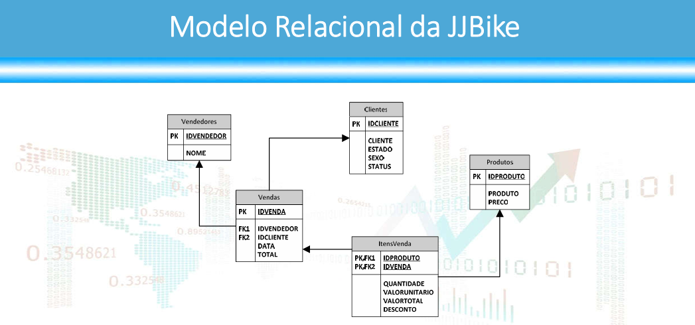
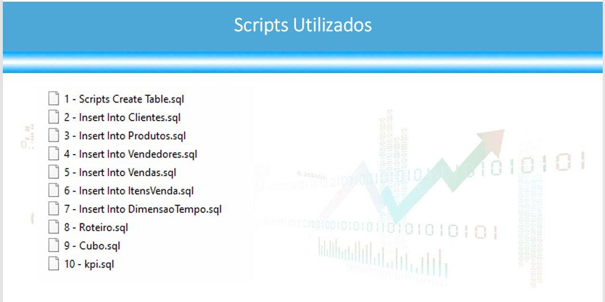

# 📊 Projeto de BI:  JJBike

> **Nota:** Este projeto foi desenvolvido como parte do curso `[Formação Analista de Dados e Business Intelligence
]` da Udemy, com o objetivo de aplicar conceitos de Business Intelligence,
> ETL e Visualização de Dados na prática.

---

## 🎯 Objetivo do Projeto
Já possui um sistema de vendas (transacional)  
O objetivo principal deste projeto foi: construir um armazém de dados para 
que o administrador da JJBike possa compreender 
seu negócio
---

## 🛠️ Tecnologias e Ferramentas Utilizadas
* **Banco de Dados / SQL SERVER EXPRESS
* **Visualização de Dados:** Power BI 
* **Linguagens/Modelagem:** DAX / SQL / Star Schema

---  

## 🧠 Processo de Desenvolvimento

### 1. Extração e Transformação dos Dados (ETL)
* Conexão com as fontes de dados (Dados`[Protected View - Excel]`).
* Limpeza de dados: remoção de duplicatas, tratamento de valores nulos e alteração de tipos de dados.
  

### 2. Modelagem de Dados
O modelo de dados foi estruturado seguindo o modelo **Star Schema** (Esquema Estrela), garantindo a performance das consultas:
* **Tabelas Fato:** `fVendas`
* **Tabelas Dimensão:** `dimensaoproduto`, `dimencaocliente`, `dimensaovendedor``dimensaotempo´, `fatovendas`
  
### Modelo  Relacional 
   

  ### Scripts Utilizados para criar o DW
 

  

### 3. Principais Métricas Criadas (DAX / Cálculos)
Aqui estão algumas das principais medidas calculadas para o negócio:
* ** Clientes Total por ESTADO, TOTAL POR CLIENTE, TOTAL POR SEXO, 5 MAIORES CLIENTES
* ** VENDEDORES 5 MELHORES VENDEDORES E 5 PIORES VENDEDORES
* ** produtos 5 mais vendidos e 5 menos vendidos, maiores descontos e menores descontos
* ** VENDAS AS VENDAS POR PRODUTOS 

---

## 📈 O Dashboard (Resultados)

*Se o seu dashboard estiver publicado na web, coloque o link aqui:*
👉 **[Clique aqui para acessar o Dashboard Interativo](LINK_DO_SEU_DASHBOARD)**

### Visualização das Telas:

#### Tela 1: ANALISE PERFIL DO CLIENTE 

#### Tela 2: Análise de Clientes

---

## 💡 Insights Extraídos do Projeto
*(Muito importante para portfólio! Mostre que você sabe analisar os gráficos)*
1. O produto **X** representa 40% do faturamento, mas sua margem é 15% menor que o produto **Y**.
2. A região **Sul** teve um crescimento de 25% ano a ano, impulsionada pela campanha de marketing de Outubro.

---

## 📄 Licença
Este projeto está sob a licença MIT - veja o arquivo [LICENSE](LICENSE) para detalhes.
